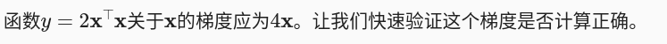

import torch

一、自动求导
    1、假设我们想对函数y=2x⊤x关于列向量x求导
        在我们计算y关于X的梯度之前，需要一个地方来存储梯度。 重要的是，我们不会在每次对一个参数求导时都分配新的内存。
        因为我们经常会成千上万次地更新相同的参数，每次都分配新的内存可能很快就会将内存耗尽。
            (注意，一个标量函数关于X向量的梯度是向量，并且与X具有相同的形状。)
    x = torch.arange(4.0)
    >>> x
    tensor([0., 1., 2., 3.])

    2、在我们计算y关于x的梯度之前，我们需要一个地方来存储梯度
    >>> x.requires_grad_(True)  # 等价于x=torch.arange(4.0,requires_grad=True)
    >>> print(x.grad) # 默认值是None
    None

    3、计算y
    （x是一个长度为4的向量，计算x和x的点积，得到了我们赋值给y的标量输出。）
    >>> y = 2 * torch.dot(x, x)
    >>> y
    tensor(28., grad_fn=<MulBackward0>)
`
    4、通过调用反向传播函数来自动计算y关于x每个分量的梯度，并打印这些梯度。
    >>> y.backward()
    >>> print(x.grad)
    tensor([ 0.,  4.,  8., 12.])
    
    5、验证是否正确
    >>> x.grad == 4 * x
    tensor([True, True, True, True])
    >>> 
    
    6、现在计算x的另一个函数。

    #（在默认情况下，PyTorch会累积梯度，我们需要清除之前的值）
    >>> x.grad.zero_()
    tensor([0., 0., 0., 0.])
    >>> y = x.sum()
    >>> y
    tensor(6., grad_fn=<SumBackward0>)
    >>> y.backward()
    >>> print(x.grad)
    tensor([1., 1., 1., 1.])

    7、深度学习中 ，我们的目的不是计算微分矩阵，而是批量中每个样本单独计算的偏导数之和
        >>> x
        tensor([0., 1., 2., 3.], requires_grad=True)

        # 对非标量调用backward需要传入一个gradient参数，该参数指定微分函数关于self的梯度。
        # 本例只想求偏导数的和，所以传递一个1的梯度是合适的
        >>> x.grad.zero_()
        tensor([0., 0., 0., 0.])

        # 等价于y.backward(torch.ones(len(x)))
        >>> y = x * x
        >>> y
        tensor([0., 1., 4., 9.], grad_fn=<MulBackward0>)

        >>> y.sum()
        tensor(14., grad_fn=<SumBackward0>)

        >>> y.sum().backward()
        >>> print(x.grad)
        tensor([0., 2., 4., 6.])

二、分离计算
    1、有时，我们希望将某些计算移动到记录的计算图之外。 例如，假设y是作为x的函数计算的，而z则是作为y和x的函数计算的。 
    想象一下，我们想计算z关于x的梯度，但由于某种原因，希望将y视为一个常数， 并且只考虑到x在y被计算后发挥的作用。
    这里可以分离y来返回一个新变量u，该变量与y具有相同的值， 但丢弃计算图中如何计算y的任何信息。 换句话说，梯度不会向后流经u到x。
    因此，下面的反向传播函数计算z=u*x关于x的偏导数，同时将u作为常数处理， 而不是z=x*x*x关于x的偏导数。

        >>> x.grad.zero_()
        tensor([0., 0., 0., 0.])
        >>> y = x * x
        >>> y
        tensor([0., 1., 4., 9.], grad_fn=<MulBackward0>)

        >>> u = y.detach()
        >>> u
        tensor([0., 1., 4., 9.])
        >>> z = u * x
        >>> z
        tensor([ 0.,  1.,  8., 27.], grad_fn=<MulBackward0>)

        >>> z.sum().backward()
        >>> z
        tensor([ 0.,  1.,  8., 27.], grad_fn=<MulBackward0>)
        >>> x.grad == u
        tensor([True, True, True, True])

        >>> print(x.grad)
        tensor([0., 1., 4., 9.])

    2、即使构建函数的计算图需要通过Python控制流（例如，条件、循环或任意函数调用），我们仍然可以计算得到的变量的梯度

        >>> def f(a):
        ...     b = a * 2
        ...     while b.norm() < 1000:
        ...         b = b * 2
        ...     if b.sum() > 0:
        ...         c = b
        ...     else:
        ...         c = 100 * b
        ...     return c
        ... 
        >>> a = torch.randn(size=(), requires_grad=True)
        >>> d = f(a)
        >>> d.backward()
        >>> 
        >>> a.grad == d / a
        tensor(True)
