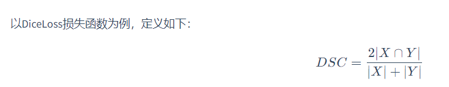

#自定义损失函数，以函数方式定义：通过输出值和目标值进行计算，返回损失值
#以类方式定义：通过继承nn.Module，将其当做神经网络的一层来看待
#可以参考Task06.md,自定义损失函数引入训练

class DiceLoss(nn.Module):
def __init__(self,weight=None,size_average=True):
super(DiceLoss,self).__init__()

	def forward(self,inputs,targets,smooth=1):
        inputs = F.sigmoid(inputs)       
        inputs = inputs.view(-1)
        targets = targets.view(-1)
        intersection = (inputs * targets).sum()                   
        dice = (2.*intersection + smooth)/(inputs.sum() + targets.sum() + smooth)  
        return 1 - dice

# 使用方法

criterion = DiceLoss()
loss = criterion(input,targets)